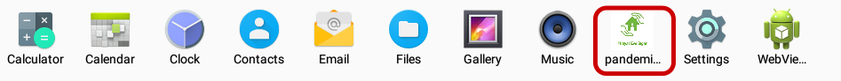
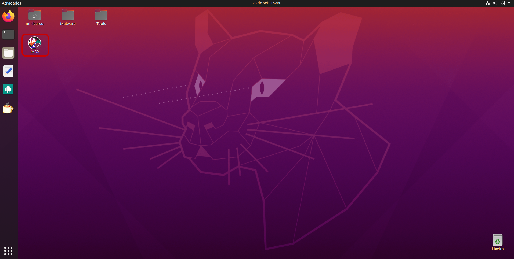
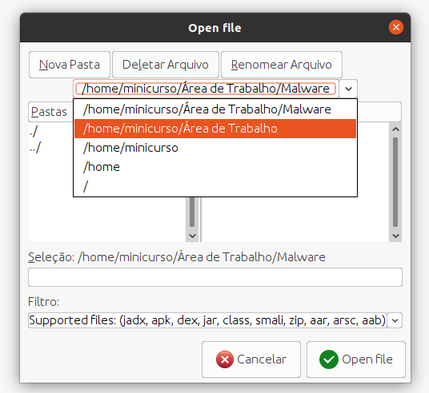
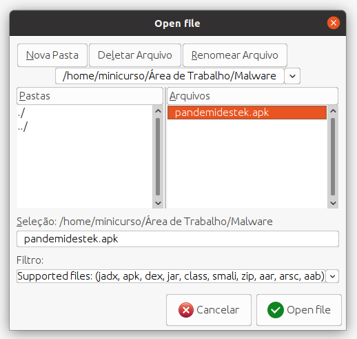
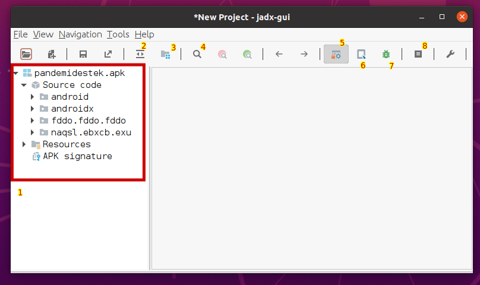

<h1>Demonstração</h1>

<p align="justify">Neste tópico, iremos juntos analisar um malware real que tenta se passar por uma aplicação legítima. Passaremos por todas as etapas de uma análise real, fazendo uso da engenharia reversa. <i>Let's enjoy the ride!</i> </p>
  
<p align="justify">Antes de iniciarmos, certifique-se de que tem todo o ambiente preparado aí na sua máquina!</p>
  
- Faça download do software <a href="https://www.virtualbox.org/wiki/Downloads">VirtualBox</a>;<br>
  - Credenciais da VM:  ```minicurso:malware ```
- Faça download da <a href="https://mega.nz/file/0VtyQbjS#tMZpaapBrAmZcqiYPpqZP7m7unH5lKKym7DI57PGKF0">máquina virtual</a> criada para esse minicurso;<br>
- Importe a máquina virtual para o VirtualBox. Caso precise de ajuda com isso, acesse este <a href="https://www.aplicativosandroid.com/como-importar-e-exportar-arquivos-ova-no-virtualbox/">link</a>.<br>
  
<br>
  
<h2>First things first</h2>
<p align="justify">O aplicativo que analisaremos já foi retirado há tempos da Play Store, então não é possível realizar a captura dos comportamentos esperados por esse meio, por isso mostraremos aqui como ele era apresentado para o público em geral.</p>

<p align="justify">Vamos analisar um malware que ficou muito famoso em 2017 e que voltou com força em 2020 graças à pandemia. Ele se passava por um aplicativo informativo, usando pessoas muito preocupadas com a COVID-19 e pouco informadas sobre malwares mobile como alvo de ataque.</p>
  
<p style="text-align:center;"></p>
<h6 align="center">Site para download do aplicativo</h6>
<br>
  
<p align="justify">Usando uma campanha falsa sobre a COVID-19 voltada para a Turquia, conseguiu enganar e perssuadir muitas pessoas a instalarem o aplicativo em seus dispositivos, através do site mostrado na foto acima ou pela Play Store.</p>
<br><br>
  
<h2>Analisando o comportamento</h2>
<p align="justify">Agora que já sabemos um pouco sobre a aplicação, podemos começar analisando seu comportamento dentro do ambiente controlado da VM apresentada no ínicio desse tópico. Precisamos instalar o apk malicioso em um dispositivo emulado e testar as funcionalidades que ele apresenta para o usuário.</p>

<p align="justify">Para fazer isso, inicie a sua VM e abra o programa <a href="https://anbox.io/">Anbox</a>, localizado na barra lateral:</p>
  
<p style="text-align:center;"></p>
<h6 align="center">Localização do Anbox na barra lateral</h6>

<br><br>

<p style="text-align:center;"></p>
<h6 align="center">Anbox após iniciar</h6>
  
<p align="justify">Esse é o nosso dispositivo Android emulado, funciona como um celular comum e podemos instalar aplicações maliciosas de qualquer tipo sem correr risco de sofrer ataques em nossas informações e documentos pessoais.</p>
  
<p align="justify">Vamos agora instalar o malware que está localizado na pasta Malware, na Àrea de Trabalho. Para isso, utilizaremos o <a href="https://developer.android.com/studio/command-line/adb?hl=pt-br&authuser=2">Android Debug Bridge</a>, que já foi mencionado anteriormente nesse minicurso. O ADB estabelece uma comunicação com dispositivos, sendo possível realizar os mais diversos testes através de uma <a href="https://guialinux.uniriotec.br/shell/">shell</a> interativa.</p>
<br>

<p align="justify">Para instalar o malware no dispositivo emulado, abra um terminal na pasta Malware e digite o seguinte comando de instalação:</p>

  ```xml
  adb install pandemistek.apk
  ```
  
<p align="justify">Caso queira aprender mais comandos do ADB, acesse: <a href="https://www.automatetheplanet.com/wp-content/uploads/2019/08/Cheat_sheet_ADB.pdf">ADB cheat Sheet</a>.</p> 
<br><br>
  
<p align="justify">Agora é possível ver o ícone da aplicação instalado no emulador:</p>
  
<p style="text-align:center;"></p>
<h6 align="center">Lista de aplicativos do emulador após intalação do malware</h6>
<br><br>

<p align="justify">Tudo pronto, podemos testar como o aplicativo funciona. Ao executar dando dois cliques na tela, vemos que um menu de configurações é aberto e é solicitada a habilitação da acessibilidade.</p>
  
<p style="text-align:center;"></p>
<h6 align="center">Janela aberta após iniciar malware</h6>

<a href="https://.pngtree.com/so/Lâmpada'>Lâmpada png de .pngtree.com/"></a><span style="color:yellow"><strong>Para pensar:</strong></span><br>
  
   - O que acontece quando a acessibilidade é ativada? Por que isso acontece?<br>
   - Por que é pedido para ativar a acessibilidade?<br>

<br><br>
<h2>Capturando Logs</h2>
<p align="justify">Analisar e acompanhar os logs é muito útil para entender o funcionamento da aplicação. Logs são informações sobre a aplicação que têm o intuito de auxiliar em testes. Essas informações vão sendo armazenadas conforme o fluxo do código é seguido, ou seja, conforme a autilização dos aplicativos. Apesar de não sermos testers, podemos utilizar os logs para descobrir quais componentes estão sendo iniciados, valores de variáveis, entrada e saída de valores, comentários sobre o fluxo do código, entre outras coisas. </p>

<p align="justify">A primeira coisa a se fazer para capturar os logs é descobrir qual o nome do pacote da aplicação:</p>
 
 ```xml
adb shell pm list packages
  ```
<br>
<p align="justify">Certamente não apareceu nenhum pacote similiar ao nome do apk, pandemistek. Lembre-se de que estamos lidando com uma aplicação maliciosa que faz uso de todos os recursos disponíveis para se passar como uma aplicação legítima, inclusive a obfuscação no pacote da aplicação. Por isso, dada a lista de pacotes, procure pelos nomes que causam mais estranhamento. Nesse caso, o nome do pacote buscado é na verdade <code class="language-plaintext highlighter-rouge">naqsl.ebxcb.exu</code></p>
<br>

<p align="justify">Sabendo o nome da aplicação, devemos agora utilizar o seguinte comando para capturar os logs:</p>

 ```xml
adb logcat | grep naqsl.ebxcb.exu
  ```

<p align="justify">Dica: Caso queira acompanhar os logs durante o uso da aplicação, deixe o terminal aberto ao testar seu funcionamento.</p>
<br><br>

<h2>Sobre o MobSF</h2>
<p align="justify">Já falamos sobre o MobSF em tópicos anteriores e seria muito interessante se pudéssemos utilizá-lo para verificar alguns pontos da aplicação, mas infelizmente não conseguimos instalar na VM por falta de espaço. Desse modo, não será possível executá-lo, mas deixamos o relatório em PDF dentro da pasta Malware. Caso queira utilizar ou olhar só por curiosidade, fique à vontade.</p>

<br><br>
<h2>Engenharia Reversa - Jadx</h2>
<p align="justify">Vamos finalmente executar a engenharia reversa propriamente dita e converter o .apk em código java para conseguirmos analisar seu código fonte. Para isso, utilizaremos o Jadx, uma ferramente já mencionada anteriormente.</p>

<p align="justify">Com o Jadx podemos simplemente importar um arquivo .apk que ele fará todo o processo de descompilação e desobfuscação, retornando um código fonte o mais próximo possível do código fonte escrito pelos desenvolvedores da aplicação. Para entender mais sobre esse processo, acesse: <a href="https://www.devmedia.com.br/descompiladores-e-ofuscadores-em-java/32486">Descompiladores e Ofuscadores em Java</a></p>

<p align="justify">Para começar, abra a aplicação do Jadx localizada na sua Àrea de trabalho:</p>

<p style="text-align:center;"></p>
<h6 align="center">Ícone da Jadx na Área de trabalho</h6>
<br>

<p align="justify">Agora é preciso selecionar o arquivo .apk que queremos descompilar. Vamos utilizar o <code class="language-plaintext highlighter-rouge">pandemistek.apk</code>, localizado na pasta Malware:</p>

<p style="text-align:center;"></p>
<h6 align="center">Selecionando a pasta</h6>
<p style="text-align:center;"></p>
<h6 align="center">Selecionando o arquivo .apk</h6>
<br>

<p align="justify">Após o processamento ser efetuado, podemos ver uma lista de pastas à esquerda, que são todas partes do código fonte da aplicação. Podemos então explorar seus arquivos e entender seu funcionamento. Mas antes, vamos entender o que os principais botões fazem:</p>

<p style="text-align:center;"></p>
<h6 align="center">principais componentes do Jadx</h6>

1. Árvore da aplicação analisada com pastas e arquivos pertecentes ao código fonte;<br>
2. Sincroniza o arquivo aberto no editor com o arquivo correspondente na árvore;<br>
3. Mostra a árvore de forma mais ou menos compacta;<br>
4. Ferramenta de busca;<br>
5. Executa o desobfuscador;<br>
6. <a href="https://www.kali.org/tools/quark-engine/">Quark Engine</a>, ferramenta de classificação de malwares;<br>
7. Ferramenta para executar análise dinâmica com <a href="https://pt.wikipedia.org/wiki/Depurador">debugger</a>;<br>
8. Visualizador de logs;<br>

<br><br>
<h2>Android Manifest</h2>
<p align="justify">Após relizada a descompilação, um dos primeiros arquivos que costumamos olhar é o AndroidManifest.xml, já que ele possui as declarações de permissões e componentes, conforme visto anteriormente.</p>

<p align="justify">A partir do AndroidManifest, vamos tentar identificar quais funcionalidades maliciosas a aplicação possui e quais são os componentes que executam essas funções, para então analisá-los de maneira mais aprofundada.</p>

- Tente localizar onde se encontra o AndroidManifest!

<br>
<p align="justify">Alguma dessas permissões te chama a atenção para uma possível funcionalidade maliciosa? Tente lembrar o que já foi falado sobre permissões.</p>

```xml
    <uses-permission android:name="android.permission.INTERNET"/>
    <uses-permission android:name="android.permission.ACCESS_NETWORK_STATE"/>
    <uses-permission android:name="android.permission.WRITE_EXTERNAL_STORAGE"/>
    <uses-permission android:name="android.permission.READ_EXTERNAL_STORAGE"/>
    <uses-permission android:name="android.permission.WAKE_LOCK"/>
    <uses-permission android:name="android.permission.GET_TASKS"/>
    <uses-permission android:name="android.permission.RECEIVE_BOOT_COMPLETED"/>
    <uses-permission android:name="android.permission.REQUEST_IGNORE_BATTERY_OPTIMIZATIONS"/>
    <uses-permission android:name="android.permission.PACKAGE_USAGE_STATS"/>
    <uses-permission android:name="android.permission.SYSTEM_ALERT_WINDOW"/>
    <uses-permission android:name="android.permission.ACCESS_COARSE_LOCATION"/>
    <uses-permission android:name="android.permission.ACCESS_FINE_LOCATION"/>
    <uses-permission android:name="android.permission.FOREGROUND_SERVICE"/>
    <uses-permission android:name="android.permission.CALL_PHONE"/>
    <uses-permission android:name="android.permission.SEND_SMS"/>
    <uses-permission android:name="android.permission.RECORD_AUDIO"/>
    <uses-permission android:name="android.permission.READ_CONTACTS"/>
    <uses-permission android:name="android.permission.READ_PHONE_STATE"/>
    <uses-permission android:name="android.permission.RECEIVE_SMS"/>
    <uses-permission android:name="android.permission.READ_SMS"/>
    <uses-permission android:name="android.permission.WRITE_SMS"/>
    <uses-permission android:name="android.permission.KILL_BACKGROUND_PROCESSES"/>
    <uses-permission android:name="android.permission.ACCESS_WIFI_STATE"/>
    <uses-permission android:name="android.permission.CHANGE_WIFI_STATE"/>
    <uses-permission android:name="android.permission.MODIFY_PHONE_STATE"/>
    <uses-permission android:name="android.permission.MODIFY_AUDIO_SETTINGS"/>
    <uses-permission android:name="android.permission.CHANGE_NETWORK_STATE"/>
```
<br><br>

<p align="justify">Além das permissões, podemos identificar qual o componente que executa primeiro sempre que a aplicação é inicializada:</p>

```xml
<activity android:name="naqsl.ebxcb.exu.Activity.MainActivity">
    <intent-filter>
        <action android:name="android.intent.action.MAIN"/>
        <category android:name="android.intent.category.LAUNCHER"/>
    </intent-filter>
</activity>
```
<br>
<a href="https://.pngtree.com/so/Lâmpada'>Lâmpada png de .pngtree.com/"></a><span style="color:yellow"><strong>Para pensar:</strong></span><br>
- Como temos certeza de que essa activity é a primeira a ser executada quando a aplicação inicia?
<br><br>
<br>
<p align="justify">Vamos agora tentar identificar quais componentes executam atividades maliciosas. Utilize  a função legítima da aplicação para te ajudar nessa tarefa e se pergunte: "Um aplicativo informativo sobre COVID-19 deveria executar essa ação?"</p>
<p align="justify">Anote tudo o que achar suspeito!</p>

<br><br>
<h2>MainActivity</h2>
<p align="justify">Vamos agora dar uma olhada na MainActivity:</p>

```java
1 public class MainActivity extends Activity {
2
3     /* renamed from: fddo  reason: collision with root package name */
4     Cint f570fddo = new Cint();
5     ifdf ifdf = new ifdf();
6
7     public MainActivity() {
8         new Cint();
9         new Cfor();
10      }
11
12      /* access modifiers changed from: protected */
13      @Override // android.app.Activity
14      public void onCreate(Bundle bundle) {
15          super.onCreate(bundle);
16          if (!this.ifdf.f477try || Build.VERSION.SDK_INT < 19) {
17              try {
18                  startService(new Intent(this, StartWhileGlobal.class));
19                  new Cint();
20              } catch (Exception unused) {
21              }
22          } else {
23              WebView webView = new WebView(this);
24              webView.getSettings().setJavaScriptEnabled(true);
25              webView.loadUrl(this.ifdf.f469byte);
26              setContentView(webView);
27          }
28          getPackageManager().setComponentEnabledSetting(new ComponentName(this, MainActivity.class), 2, 1);
29          try {
30              Cint.fddo(this, "startAlarm", (long) Integer.parseInt(this.f570fddo.fddo(this, "interval")));
31          } catch (Exception unused2) {
32              Cint.fddo(this, "startAlarm", 10000);
33          }
34          if (!this.ifdf.f477try) {
35              finish();
36          }
37      }
38  }
```
<br>
<p align="justify">Apesar do código ter passado pelo desofuscador, ainda existem algumas palavras que não são de fácil entendimento. Por isso, tente sempre utilizar o contexto ao seu favor.</p>
<br>
<p align="justify">Vamos tentar agora entender o que acontece nesse arquivo:</p>
<p align="justify">Ao olhar o método onCreate (linha 14), vemos que uma verificação é feita: se algo do tipo <code class="language-plaintext highlighter-rouge">this.ifdf.f477try</code> é falso ou se a versão do SDK é menor que 19, tenta-se executar um service.</p>
<p align="justify">Caso a verificação falhe, um WebView é aberto em uma URL desconhecida. Em seguida, alguns componentes de configuração são habilitados e tenta-se ativar o que parece ser um alarme.</p>
<br>
  
<p align="justify">Após essa análise rápida, ficam alguns questionamentos:</p>

  - O que esse service faz?
  - Qual a url da WebView que é aberta e por que abrir uma WebView?
  - Por que setar um alarme?

<br><br>
<h2>O que mais você consegue descobrir?</h2>
<p align="justify">Chegou a sua vez de aplicar tudo o que aprendeu durante esse minicurso!</p>
<p align="justify">Tente desbravar as pastas e arquivos da aplicação, de acordo com o que você anotou ao analisar o AndroidManifest. Anote tudo o que achar interessante!</p>
<p align="justify">Faremos uma discussão sobre os resultados em breve :)</p>

<br><br>
<p style="text-align:center;"></p>
<h6 align="center">?</h6>
  
  
<br><br>
<hr />
<h3 align="right">Tópicos</h3>
<ul align="right">
<a href="https://darknenblack.github.io/RevEng-Android/">Engenharia Reversa</a><br>
<a href="https://darknenblack.github.io/RevEng-Android/fundamentos.html">Fundamentos de Android</a><br>
<a href="https://darknenblack.github.io/RevEng-Android/estatica.html">Análise Estática</a><br>
<a href="https://darknenblack.github.io/RevEng-Android/malware.html">Malwares</a><br>
<a href="https://darknenblack.github.io/RevEng-Android/demo.html">Demo</a><br>
<a href="https://darknenblack.github.io/RevEng-Android/ref.html">Referências</a><br>
</ul>
