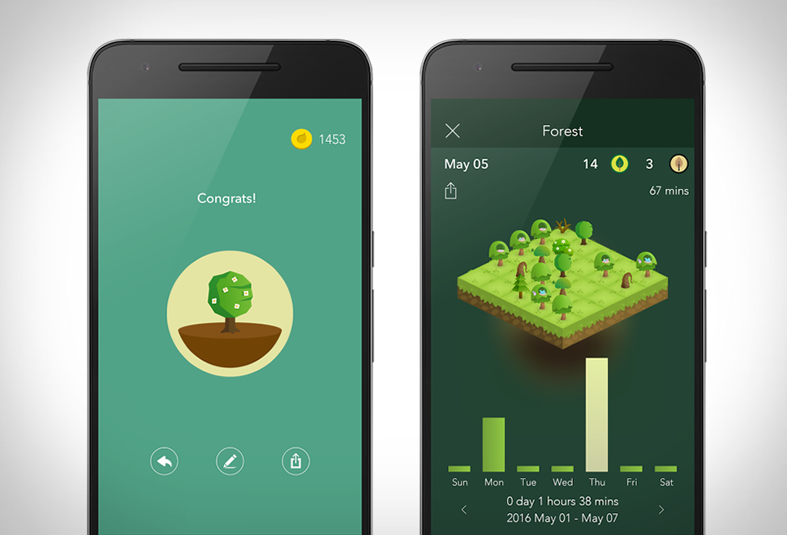

<h1>Fundamentos de Android</h1>
  <p>Nesse tópico serão apresentados os principais componentes de uma aplicação Android.</p>
 
<br>
<h2>Pontos de Entrada</h2>
  <p align="justify">Saber quais são os pontos de entradas da aplicação é super importante para realizar a engenharia reversa, 
  pois é através deles que usuários e o próprio sistema interagem e acessam os aplicativos. 
  Em desenvolvimento Android existem quatro componentes principais:</p>

<br>
<h3>Activities</h3>
  <p align="justify">Activities são consideradas a camada de apresentação dos aplicativos. Praticamente toda a interface da aplicação é construída em torno desse componente, definindo o layout e respostas à interações com o usuário.</p>
  
  
   ```java
   	public class MainActivity extends AppCompatActivity {

		@Override
		protected void onCreate(Bundle savedInstanceState) {
			super.onCreate(savedInstanceState);
			setContentView(R.layout.activity_main);
		}
	}
   ```
  
  <p>Quando existem mais de uma activity em uma mesma aplicação, uma delas precisa ser definida, no arquivo de manifesto d como aquela que será apresentada quando o aplicativo iniciar.</p>
```xml
	<code><activity android:name=".InitialActivity">
	  	<intent-filter>
    	  		<action android:name="android.intent.action.MAIN" />
        		<category android:name="android.intent.category.LAUNCHER" />
    		</intent-filter>
  	</activity></code>
```
  
<h3>Services</h3>
<h3>Content Providers</h3>
<h3>Broadcast Receivers</h3>

<br>
<h2>Android Manifest</h2>
  <p>Toda aplicação Android possui um arquivo de manifesto, o <code class="language-plaintext highlighter-rouge">AndroidManifest.xml</code>, 
  que define toda a estrutura, metadados, permissões e componentes do aplicativo.</p>
  
<br>
<h2>.APK</h2>

  
<br><br>
<hr />
<h3 align="right">Tópicos</h3>
<ul align="right">
  <a href="https://darknenblack.github.io/RevEng-Android/">Engenharia Reversa</a><br>
  <a href="https://darknenblack.github.io/RevEng-Android/fundamentos.html">Fundamentos de Android</a><br>
  <a href="https://darknenblack.github.io/RevEng-Android/estatica.html">Análise Estática</a><br>
  <a href="https://darknenblack.github.io/RevEng-Android/malware.html">Malwares</a><br>
  <a href="https://darknenblack.github.io/RevEng-Android/demo.html">Demo</a><br>
  <a href="https://darknenblack.github.io/RevEng-Android/ref.html">Referências</a><br>
</ul>
