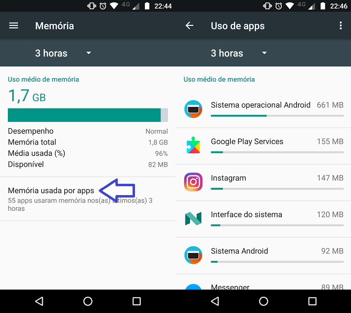
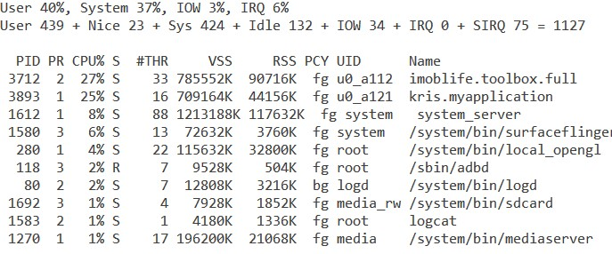

<h1>Analisando Malwares</h1>
<p align="justify">Agora que já entendemos o básico sobre o funcionamento da plataforma Android, a organização da estrutura de um APK e as principais 
  ferramentas utilizadas para análise estática, vamos falar sobre Malwares.</p>

<br><br>
<h2>O que são Malwares?</h2>
<p align="justify">Segundo o Centro de Recursos de Segurança da Computação, <a href="https://csrc.nist.gov/glossary/term/malware">Malware</a> é:</p>
 
>"Um programa que está inserido em um sistema, geralmente disfarçado, causando o comprometimento da confidencialidade, integridade ou disponibilidade dos dados, aplicações e sistema operacional da vítima."
  
<p align="justify">Ou seja, são aqueles programas conhecidos como <strong>vírus</strong>. Dentre os vários tipos existentes, podemos citar:</p>
 
  - Trojans<br>
  - Ransomware<br>
  - Backdoor<br>
  - Adware<br>
  - Spyware<br>
  
<p align="justify">Para saber mais sobre malwares, acesse o post da <a href="https://www.redhat.com/pt-br/topics/security/what-is-malware">RedHat</a></p>

<br>
<p align="justify">Serão apresentados agora as técnicas mais usuais para identificar comportamentos maliciosos. Fique atento pois as usaremos no próximo tópico para estudar um malware real.</p>

<br><br>
<h2>Virus Total</h2>
<p align="justify">O <a href="https://www.virustotal.com/gui/home/upload">Virus Total</a> é uma plataforma online que analisa arquivos e URLs na tentativa de identificar malwares. Isso é feito utilizando um banco de dados de antivírus parceiros para determinar se o artefato analisado é mal-intencionado ou não, usando também como resultado a forma como esses vários antivírus realizam as suas classificações.</p>
<p align="justify">Apesar dele não ter a função de um antivírus, seu uso pode ser vantajoso quando falamos de pré-análises, sendo útil para nos dar uma ideia se estamos realmente trabalhando com um malware.</p>

<p style="text-align:center;"></p>
<h6 align="center">Logo - Virus Total</h6>

<br><br>
<h2>Análise da Memória</h2>
<p align="justify">Dentre os comportamentos que podem indicar a existência de um malware, podemos citar uso de bateria e sobrecarga do processador unido à grande demanda de memoria RAM, e quanto mais recursos o aplicativo demandar, mais problemas relacionados a isso irão aparecer. Para saber mais, leia o blog post da <a href="https://ada.vc/2018/05/07/processador-celular/">ada.vc</a></p>

<p align="justify">Verificar quanto de bateria ou quanto de memória um aplicativo está utilizado é uma estratégia na identificação de malwares. Podemos, por exemplo, analisar o uso de memória e bateria através dos relatórios de uso de memória e bateria do Android.</p>

<p style="text-align:center;"><a href="https://www.tecmundo.com.br/software/124422-descobrir-aplicativos-consomem-memoria-ram-android.htm"></a></p>
<h6 align="center">Relatório de uso de memória no Android</h6>
<br>
<p align="justify">Podemos também analisar o uso da CPU utilizando o <a href="https://developer.android.com/studio/command-line/adb?hl=pt-br">ADB</a>:</p>
  
  ```
    adb shell top -m 10
  ```
<br>
<p align="justify">Esse comando mostra o top 10 aplicativos que mais fazem uso da CPU. Na imagem abaixo, podemos ver que apenas um aplicativo, o <i>imoblife.toolbox.full</i>, consome 27% do uso do processador e, nesse caso, se trata de uma aplicação maliciosa chamada <i>All in one toolbox</i></p>

<p style="text-align:center;"><a href="https://www.researchgate.net/figure/CPU-monitoring-of-malicious-application-toolbox_fig1_327003526"></a></p>
<h6 align="center">Monitoramento da CPU utilizando adb</h6>

<br><br>
<h2>Análise da Tráfego</h2>
<p align="justify">Verificar todas as interações que o aplicativo faz através da rede e determinar se essas ações são maliciosas também é uma técnica para identificação de malwares. Podemos considerar suspeito todo tráfego que foge do convencional. Dentre as características desse tipo de comportamento podemos listar:</p>

- Pacotes malformados;
- Grande quantidade de pacotes por segundo, podendo indicar ataque <a href="https://pt.wikipedia.org/wiki/Ataque_de_nega%C3%A7%C3%A3o_de_servi%C3%A7o">DoS</a>;
- Pacotes com senhas e/ou dados textuais em texto plano;
- Aplicação checando periodicamente com um servidor remoto;
- Presença de protolocos não usuais;
- Repetidas tentativas de quebra de senhas.

<br><br>
<h2>Análise Estática</h2>

<p align="justify">Como já vimos no tópico anterior, a análise estática é uma abordagem extremamente importante, já que é através dela que conseguimos identificar comportamentos maliciosos revisando diretamente o código da aplicação. Percebam que tudo o que vimos até agora pode nos ajudar a realizar uma análise efetiva na busca de aplicações maliciosas.</p>

<p align="justify">Pontos importantes da análise estática:</p>

1. Permissões
2. AndroidManifest
3. Chamadas para API
4. Strings

<p align="justify">Algo que pode prejudicar na realização da análise estática (e na engenharia reversa como um todo) é a <a href="https://bloghackingu.wordpress.com/2018/04/18/ofuscacao-de-codigos-maliciosos/">ofuscação</a> do código. Utilizada muitas vezes como medida de segurança, tem como objetivo embaralhar e modificar o código de modo que as funcionalidades da aplicação não se alterem, mas a visualização do que realmente está acontecendo no código fonte seja dificultada. A obfuscação pode, por vezes, diminuir o tamannho ou camuflar nomes arquivos.</p>

<br><br>
<h2>Análise Dinâmica</h2>
<p align="justify">Enquanto que na análise estática verificamos o código fonte escrito pelos desenvolvedores, na análise dinâmica certificamos o que foi visto na estática, realizando testes que atuam diretamente com o comportamento que a aplicação apresenta ao usuário.</p>
<p align="justify">A análise diâmica nos dá uma noção melhor sobre a forma que o aplicativo age e quais ações ele executa a cada momento, sendo possível dessa forma determinar qual fluxo o código segue, facilitando o entendimento do funcionamento da aplicação.</p>
<p align="justify">Uma das formas de executar a análise dinâmica é fazendo uso do <a href="https://developer.android.com/studio/command-line/adb?hl=pt-br&authuser=2">ADB</a>, pois ele cria uma conexão com um dispositivo e conseguimos chamar e inicar todos os componentes exportados da aplicação, passando extras, actions e flags. Desse modo, podemos utilizar o ADB em conjunto com a visualização dos logs e do próprio comportamento que é apresentado na tela do dispositivo para identificar quais as suas funcionalidades, vulnerabilidades e comportamentos.</p>

<br><br>
<h2>Onde encontrar malwares?</h2>
<p align="justify">As lojas de aplicativos tentam a todo custo manter seus clientes longe de aplicações maliciosas, não que isso aconteça de fato, mas é muito mais dificil encontrar um malware na PlayStore do que na internet como um todo. Por esses motivos, deixamos aqui uma lista de opções para você continuar seus estudos sobre malwares :)</p>

1. [Ashishb GitHub](https://github.com/ashishb/android-malware)
2. [Sk3ptr GitHub](https://github.com/sk3ptre/AndroidMalware_2020)
3. [Koodous](https://koodous.com/)
4. [Das Malwerk](https://dasmalwerk.eu/)
5. [Malware Bazar](https://bazaar.abuse.ch/browse/)
  
<hr />
  <p align="center">  <span style="color:red"><strong>ATENÇÃO!</strong></span><br>
  Tome muito cuidado ao manusear essas aplicações!<br>
  Não incentivamos nenhum tipo de atividade hacker ilegal<br>
  Utilize malwares apenas para fins de estudo, nunca realize download ou execute no seu dispositivo pessoal. </p>


  
  
<br>
<hr />
<h3 align="right">Tópicos</h3>
<ul align="right">
<a href="https://darknenblack.github.io/RevEng-Android/">Engenharia Reversa</a><br>
<a href="https://darknenblack.github.io/RevEng-Android/fundamentos.html">Fundamentos de Android</a><br>
<a href="https://darknenblack.github.io/RevEng-Android/estatica.html">Análise Estática</a><br>
<a href="https://darknenblack.github.io/RevEng-Android/malware.html">Malwares</a><br>
<a href="https://darknenblack.github.io/RevEng-Android/demo.html">Demo</a><br>
<a href="https://darknenblack.github.io/RevEng-Android/ref.html">Referências</a><br>
</ul>
