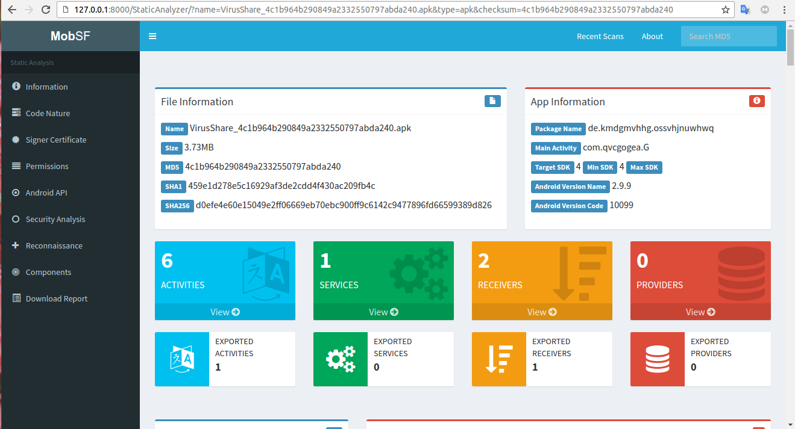

<h1>Analisando Malwares</h1>

Agora que já entendemos o básico sobre o funcionamento da plataforma Android, a organização da estrutura de um APK e as principais 
  ferramentas utilizadas para análise estática, vamos falar sobre Malwares.

 
<h2>O que são Malwares?</h2>

Segundo o Centro de Recursos de Segurança da Computação, <a href="https://csrc.nist.gov/glossary/term/malware">Malwares</a> é:

 
>"Um programa que está inserido em um sistema, geralmente disfarçado, causando o comprometimento da confidencialidade, integridade ou disponibilidade dos dados, aplicações e sistema operacional da vítima."
  

Ou seja, são aqueles programas conhecidos como <strong>vírus</strong>. Dentre os vários tipos existentes, podemos citar:

 
  - Trojans 
  - Ransomware 
  - Backdoor 
  - Adware 
  - Spyware 
  

Para saber mais sobre malwares, acesse o post da <a href="https://www.redhat.com/pt-br/topics/security/what-is-malware">RedHat</a>

 

Serão apresentados agora as técnicas mais usuais para identificar comportamentos maliciosos. Fique atento pois as usaremos no próximo tópico para estudar um malware real.

<h3>Permissões</h3>

 Permissões são utilizadas para garantir alguns comportamentos e limitações dos componentes de uma aplicação, podendo indicar quais outros aplicativos podem se conectar e ações que ele pode realizar, muitas vezes permitindo que aplicativos executem ações maliciosas. Por exemplo, um aplicativo de música não deveria ter permissão para acessar os arquivos e a camerâ do celular.

As permissões do Android estão classificadas em quatro níveis diferentes:

  
| Nível da Permissão| Comentários                                                                      | 
|:------------------|:---------------------------------------------------------------------------------|
| Normal            | Não podem causar dano ao usuário.                                                |
| Dangerous         | Podem causar dano ao usuário.                                                    |
| Signature         | Garante a comunicação entre aplicativos assinador com o mesmo certificado.       | 
| Signature/System  | O mesmo que Signature, mas foi projetado apenas para fabricantes de dispositivos.|
  

 

Algumas <a href="https://developer.android.com/reference/android/Manifest.permission">permissões</a> que podem indicar comportamento malicioso:

  - android.permission.ACCESS_NETWORK_STATE
  - android.permission.INTERNET
  - android.permission.WRITE_EXTERNAL_STORAGE
  - android.permission.READ_EXTERNAL_STORAGE
  - android.permission.READ_PHONE_STATE
  - android.permission.CHANGE_WIFI_STATE
  - android.permission.RECEIVE_BOOT_COMPLETED
  - android.permission.ACCESS_MEDIA_LOCATION
  - android.permission.SEND_SMS
  - android.permission.CAMERA
  - android.permission.VIBRATE
  - android.permission.REQUEST_INSTALL_PACKAGES

 
<h3><a href="https://github.com/MobSF/Mobile-Security-Framework-MobSF">MobSF</a></h3>

É uma ferramenta de análise automatizada para aplicações mobile - APK, XAPK, IPA & APPX. Com essa ferramenta é possível fazer uma triagem rápida sobre as principais informações do aplicativo, ou também optar por uma abordagem mais aprofundada, realizando tanto análise estática quanto dinâmica.

Com o MobSF é possível fazer revisões do código, detectar permissões e configurações e verificar os mais diversos comportamentos como chamadas de API, componentes do tipo ´browsable´ e armazenamento inseguro. São muitas as possibilidades!

Para saber mais, acesse: <a href="https://www.redbelt.com.br/blog/2021/04/29/automatizando-enumeracao-em-mobile-mobsf/">Automatizando Enumeração em Mobile</a>

 
<h3>Análise estática</h3>

 
<h3>Análise da Memória</h3>

 
<h3>Análise da Tráfego</h3>

  
 
<h2>Onde encontrar malwares?</h2>

As lojas de aplicativos tentam a todo custo manter seus clientes longe de aplicações maliciosas, não que isso aconteça de fato, mas é muito mais dificil encontrar um malware na PlayStore do que na internet como um todo. Por esses motivos, deixamos aqui uma lista de opções para você continuar seus estudos sobre malwares :)

1. [Ashishb GitHub](https://github.com/ashishb/android-malware)
2. [Sk3ptr GitHub](https://github.com/sk3ptre/AndroidMalware_2020)
3. [Koodous](https://koodous.com/)
4. [Das Malwerk](https://dasmalwerk.eu/)
5. [Malware Bazar](https://bazaar.abuse.ch/browse/)
  

  
  <strong>ATENÇÃO!</strong> 
  Tome muito cuidado ao manusear essas aplicações! 
  Não incentivamos nenhum tipo de atividade hacker ilegal 
  Utilize malwares apenas para fins de estudo, nunca realize download ou execute no seu dispositivo pessoal. 

  
  
  

<h3 align="right">Tópicos</h3>
<ul align="right">
<a href="https://darknenblack.github.io/RevEng-Android/">Engenharia Reversa</a> 
<a href="https://darknenblack.github.io/RevEng-Android/fundamentos.html">Fundamentos de Android</a> 
<a href="https://darknenblack.github.io/RevEng-Android/estatica.html">Análise Estática</a> 
<a href="https://darknenblack.github.io/RevEng-Android/malware.html">Malwares</a> 
<a href="https://darknenblack.github.io/RevEng-Android/demo.html">Demo</a> 
<a href="https://darknenblack.github.io/RevEng-Android/ref.html">Referências</a> 
</ul>
